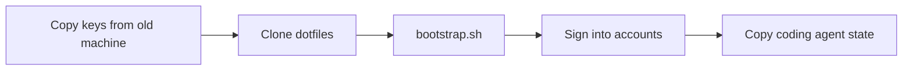

# Dotfiles (Dotter)

Migrated from chezmoi to [dotter](https://github.com/SuperCuber/dotter) for cleaner, simpler dotfile management.

## Why Switch from Chezmoi?

| Chezmoi Pain Point | Dotter Solution |
|-------------------|-----------------|
| `dot_` prefix on every file | Files named exactly as they appear |
| Go template syntax: `{{ if eq .chezmoi.os "darwin" }}` | Handlebars: `{{#if (eq dotter.os "macos")}}` |
| Source files in `~/.local/share/chezmoi` | Files directly in `~/dotfiles` |
| Complex encapsulation | Simple symlink + template model |

## Quick Start

### macOS — one command (fully automated)

```bash
git clone https://github.com/huaxel/dotfiles.git ~/dotfiles
cd ~/dotfiles && ./bootstrap.sh
```

`bootstrap.sh` will, in order: install Homebrew → install dotter + git + age +
sops + mas → enable git hooks → generate an age key if missing →
`dotter deploy` (renders templates, symlinks, decrypts secrets) →
`brew bundle` the full `config/Brewfile` → apply `macos/defaults.sh`.

Toggles: `SKIP_BREW_BUNDLE=1` and `SKIP_MACOS_DEFAULTS=1`.

> Secrets: if you have an existing age key, restore it to
> `~/.config/sops/age/keys.txt` **before** running bootstrap. Otherwise a new
> key is generated and you must authorize it in `.sops.yaml` and rotate
> secrets (see [Secrets Management](#secrets-management-sops--age)).

### Linux / manual

```bash
# 1. Install dotter (cargo) and clone
cargo install dotter
git clone <your-repo> ~/dotfiles
cd ~/dotfiles

# 2. Deploy (creates symlinks) — or just run ./bootstrap.sh
dotter deploy
```

## File Structure

```
~/dotfiles/
├── .dotter/
│   ├── global.toml      # Main configuration
│   └── local.toml       # Machine-specific settings
├── zshrc                # Template → ~/.zshrc
├── gitconfig            # Template → ~/.gitconfig
├── aerospace            # macOS window manager → ~/.aerospace.toml
├── ideavimrc            # → ~/.ideavimrc
├── gitignore_global     # → ~/.gitignore_global
├── ssh_config           # → ~/.ssh/config (copied, not symlinked)
└── config/              # → ~/.config/
    ├── nvim/
    ├── ghostty/config   # Template for shell integration
    └── ...              # 1000+ other configs
```

## Templates (Handlebars)

OS-specific configuration is much cleaner than chezmoi:

```handlebars
{{#if (eq dotter.os "macos")}}
# macOS-specific config
export PATH="/opt/homebrew/bin:$PATH"
{{/if}}
```

Available variables:
- `dotter.os` - "macos", "linux", "windows"
- `dotter.hostname` - machine name
- `dotter.arch` - architecture
- `name`, `email`, `github_username` - from global.toml

## Commands

```bash
dotter deploy          # Create symlinks and render templates
dotter undeploy        # Remove all symlinks
dotter --dry-run       # Preview changes
dotter watch           # Auto-deploy on file changes
```

## Migrating from Chezmoi

To switch over on a machine currently using chezmoi:

```bash
# 1. Backup current state
chezmoi state dump > ~/chezmoi-backup.json

# 2. Remove chezmoi's files (careful - this removes the actual dotfiles!)
chezmoi destroy

# 3. Deploy with dotter
cd ~/dotfiles
dotter deploy --force

# 4. Reload shell
exec zsh
```

## Chezmoi vs Dotter Syntax

| Task | Chezmoi | Dotter |
|------|---------|--------|
| Rename file | `dot_zshrc.tmpl` | `zshrc` |
| OS conditional | `{{ if eq .chezmoi.os "darwin" }}` | `{{#if (eq dotter.os "macos")}}` |
| Variable | `{{ .chezmoi.os }}` | `{{dotter.os}}` |
| Apply | `chezmoi apply` | `dotter deploy` |

## What's Not Included

Removed from chezmoi migration:
- `sketchybar-app-font/` - This is a separate project (GitHub repo), not a dotfile
- GitHub Actions workflow files with `${{ secrets }}` syntax

These should be installed separately via git clone or package manager.

## llama.cpp Models

Model paths are machine-specific, so the models config is a **template** (`llama-models.ini`) that uses variables from `local.toml`.

### First-time setup on a new machine

Each machine needs a `.dotter/local.toml` with the right `models_base_path`:

**Linux (this machine — framearch-juan):**
```toml
packages = ["default"]

[variables]
os = "linux"
name = "Juan Benjumea"
email = "benjumeamoreno@gmail.com"
hostname_color = "fg:#f7768e"
models_base_path = "/mnt/ai_models/models"
```

**macOS (M2 Mac):**
```toml
packages = ["default"]

[variables]
os = "macos"
name = "Juan Benjumea"
email = "benjumeamoreno@gmail.com"
hostname_color = "fg:#f7768e"
models_base_path = "/Users/juanbenjumea/.cache/huggingface/hub"
```

The template branches on `os`:
- **Linux** → Vulkan/RADV, 14 gen threads, per-model speculative decoding configs
- **macOS** → Metal, 4 gen threads, minimal model set

### Adding models

Edit `llama-models.ini` in the dotfiles root, then:

```bash
cd ~/dotfiles && dotter deploy --force && sudo systemctl restart llama.cpp
```

Model paths use HuggingFace Hub cache layout:
```
{{ models_base_path }}/models--author--model-name-GGUF/snapshots/<hash>/file.gguf
```

## Local Machine Config

Create `~/.config/local/zshrc` for machine-specific settings not tracked in git:

```bash
# ~/.config/local/zshrc
export WORK_API_KEY="secret"
alias workvpn="openvpn --config ~/work.ovpn"
```

This is sourced at the end of the main zshrc.

---

## New Machine Setup

Setting up a new Mac (e.g., MacBook Air M5): bootstrap captures most things,
but some state must be copied from the old machine.

### Order of operations



### Copy method

The repo includes a backup script (`scripts/backup-to-kingston.sh`) and a restore
script (`scripts/restore-from-kingston.sh`). Run the backup on the old machine,
then the restore on the new one.

**On the old machine — backup everything:**

```bash
# Clone the latest bootstrap changes first
git -C ~/dotfiles pull

# Run the backup script
~/dotfiles/scripts/backup-to-kingston.sh
```

This copies: age key, SSH keys, GPG keys, Claude CLI, Codex, all coding
agents (Gemini, WakaTime, Cursor, Copilot, Orca, etc.), Alfred workflows +
license, Itsycal prefs, Logi Options+ config, shell history, and your code
projects.

**On the new machine — restore:**

```bash
# 1. Restore keys + data from KingstonPhotos
~/dotfiles/scripts/restore-from-kingston.sh

# 2. Then run bootstrap
exec ./bootstrap.sh
```

The restore script copies keys BEFORE bootstrap (so secrets decrypt),
then agent state and app data after.

### Step 1: Copy keys from old machine (before bootstrap!)

These **must** exist before running bootstrap.sh or secrets won't decrypt:

| What | Path | Why |
|---|---|---|
| **Age key** | `~/.config/sops/age/keys.txt` | Decrypts all encrypted secrets (API keys, pi auth, env vars) |
| **SSH keys** | `~/.ssh/` | Git push, server access |
| **GPG keys** | `~/.gnupg/` | Commit signing |

Without the age key, bootstrap creates a *new* key and every secret stays
encrypted — you'd have to add the new key to `.sops.yaml` and re-encrypt all
secrets from this machine.

### Step 2: Clone and bootstrap

```bash
git clone https://github.com/huaxel/dotfiles.git ~/dotfiles
cd ~/dotfiles && ./bootstrap.sh
```

### Step 3: Sign into accounts

| Service | How |
|---|---|
| **Apple ID** | System Settings → sign in (needed for mas App Store apps) |
| **Claude Desktop** | Launches → re-auth via GitHub OAuth |
| **Claude Code** | `claude` in terminal → re-auth |
| **Codex** | Launches → re-auth |
| **Tailscale** | Tailscale.app → re-auth |
| **Atuin** | `atuin login` (cloud-syncs history) or copy local db |
| **Zed** | Open → sign into GitHub Copilot / Claude ACP |
| **Ghostty theme** | `pi ghostty theme sync` |
| **Cursor** | Launches → sign in |
| **WakaTime** | Copy `~/.wakatime/wakatime.cfg` for API key or paste fresh key |

### Step 4: Copy coding agent state

#### 🟢 Small / auth-only (copy after bootstrap)

| Agent | Path | Size | What's in it |
|---|---|---|---|
| **Pi** | `~/dotfiles/pi/agent/auth.json` | 4 KB | Auto-decrypted from encrypted secrets. Already handled. |
| **GitHub Copilot** | `~/.config/github-copilot/` | 524 KB | Auth tokens, hosts.json |
| **Cursor** | `~/.cursor/` | 2.3 MB | Skills, hooks.json (re-creatable on sign-in) |
| **Gemini CLI** | `~/.gemini/` | 26 MB | Auth, cache. Re-auth on first use. |
| **WakaTime** | `~/.wakatime/` | 21 MB | WakaTime.cfg with API key. Copy or re-auth. |
| **OpenCode** | `~/.config/opencode/` | 64 MB | Mostly re-installable `node_modules/`. Config is minimal. |
| **Devin** | `~/.config/devin/` | 8 KB | Config — copy or recreate |
| **Kimi Code** | `~/.kimi-code/` | 4 KB | Config |
| **Jules** | `~/.jules/` | 4 KB | Config |
| **Grok** | `~/.grok/` | 8 KB | Config |
| **Orca** | `~/.orca/` | 52 KB | Config + workspace state |

### 🟡 App-specific data (NOT captured by brew cask install)

| App | Path | Size | Why you need it |
|---|---|---|---|
| **Alfred** | `~/Library/Application Support/Alfred/` | 17 MB | Workflows, snippets, clipboard history, **Powerpack license** |
| **Itsycal** | `~/Library/Preferences/com.mowglii.ItsycalApp.plist` | 4 KB | Calendar preferences |
| **Logi Options+** | `~/Library/Application Support/LogiOptionsPlus/` | varies | Mouse button config, MX Keys customizations |
| **DisplayLink** | `~/Library/Preferences/com.displaylink.*.plist` | 4 KB | DisplayLink driver preferences |

> Installing a cask via brew gives you the **app binary**, not your user data.
> Alfred workflows, Powerpack license, mouse configs — these live in
> `~/Library/Application Support/` and `~/Library/Preferences/` and must
> be copied separately.

#### 🔴 Large state (copy after bootstrap, optional)

| Agent | Path | Size | What's in it |
|---|---|---|---|
| **Codex CLI** | `~/.codex/` | **236 MB** | Auth, config, history, sessions, skills, plugins, DBs |
| **Codex app** | `~/Library/Application Support/Codex/` | **122 MB** | Chromium cache (skip — re-creatable) |
| **Claude Desktop** | `~/Library/Application Support/Claude/` | **~8 GB** | Conversations, MCP configs, claude-code sessions |
| **Claude CLI** | `~/.claude/` | **~430 MB** | Projects (344 MB), plugins (17 MB), settings |
| **Atuin history** | `~/.local/share/atuin/` | ~8 MB | Shell history (or cloud-sync via `atuin login`) |
| **Fish history** | `~/.local/share/fish/` | ~1 MB | Shell history (small, easy to copy) |

### What gets installed fresh (no copy needed)

- **nvim plugins** — auto-installed on first `nvim` launch (Lazy.nvim)
- **mise tools** — `mise install` re-downloads from config
- **npm packages** — re-installed via `npm install`
- **Docker images** — re-pulled
- **Pi sessions** — re-created as you work (in `pi/agent/sessions/`)

---

## Secrets Management (sops + age)

Encrypted secrets live in the dotfiles repo and auto-decrypt on `dotter deploy`.

### Prerequisites

```bash
# macOS
brew install sops age

# Arch Linux
pacman -S sops age

# Ubuntu/Debian
# Download from https://github.com/getsops/sops/releases
# and https://github.com/FiloSottile/age/releases
```

### Setup on a new machine

**1. Generate an age key** (one per machine):

```bash
mkdir -p ~/.config/sops/age
age-keygen -o ~/.config/sops/age/keys.txt
```

This prints a **public key** like `age1xxx...`. Add it to `.sops.yaml` in the dotfiles repo so this machine can decrypt:

```bash
cd ~/dotfiles
# Edit .sops.yaml and add the new public key to the age list
git add .sops.yaml
git commit -m "feat(secrets): add <machine-name> age key"
git push
```

**2. Pull and deploy**:

```bash
cd ~/dotfiles && git pull
dotter deploy
# → secrets auto-decrypt to ~/.config/secrets/
```

### How to add a secret

**1. Create the plaintext file** (never commit this):

```bash
cat > ~/dotfiles/secrets/env.fish <<'EOF'
set -x FIREWORKS_API_KEY "your-key-here"
set -x OPENAI_API_KEY "your-key-here"
set -x ANTHROPIC_API_KEY "your-key-here"
EOF
```

**2. Encrypt it**:

```bash
cd ~/dotfiles/secrets
sops --encrypt env.fish > env.fish.enc
```

**3. Remove plaintext and commit encrypted**:

```bash
rm env.fish
cd ~/dotfiles
git add secrets/env.fish.enc
git commit -m "chore(secrets): add API keys"
git push
```

### How to use decrypted secrets

**Fish** (`~/.config/fish/config.fish`):
```fish
if test -f ~/.config/secrets/env.fish
    source ~/.config/secrets/env.fish
end
```

**Zsh/Bash** (`~/.zshrc`):
```bash
[ -f ~/.config/secrets/env.fish ] && . ~/.config/secrets/env.fish
```

### What gets encrypted vs. what's ignored

| Tracked in git | Ignored |
|---|---|
| `secrets/*.enc` | `secrets/*` (plaintext) |
| `secrets/README.md` | `~/.config/secrets/` (decrypted) |
| `.sops.yaml` | `~/.config/sops/age/keys.txt` |

### Adding a new machine to decrypt existing secrets

If you have a new machine that needs to read existing secrets:

1. Generate age key on new machine
2. Add the **public key** to `.sops.yaml` (comma-separated)
3. **Re-encrypt all secrets** so the new key is included:

```bash
cd ~/dotfiles/secrets
for f in *.enc; do
  sops --rotate -in-place "$f"
done
git add *.enc
git commit -m "chore(secrets): rotate keys for new machine"
git push
```

Then on the new machine:
```bash
cd ~/dotfiles && git pull && dotter deploy
```

### Troubleshooting

**"Failed to decrypt"** — wrong age key:
```bash
# Verify your key exists
cat ~/.config/sops/age/keys.txt

# Check which keys the file was encrypted for
sops --encrypt --show-master-keys secrets/env.sh.enc
```

**"sops: command not found"** — install it:
```bash
# Arch
pacman -S sops
# macOS
brew install sops
```

**Secrets not decrypting on deploy** — check the post-deploy hook ran:
```bash
cd ~/dotfiles && dotter deploy 2>&1 | tail -20
# Should show: "🔐 Decrypting env.sh..."
```

### Full example: adding a Fireworks API key

```bash
# 1. Create the secret
cat > ~/dotfiles/secrets/fireworks.env <<'EOF'
export FIREWORKS_API_KEY="fw-abc123..."
EOF

# 2. Encrypt
cd ~/dotfiles/secrets
sops --encrypt fireworks.env > fireworks.env.enc

# 3. Clean up
cd ~/dotfiles
rm secrets/fireworks.env

# 4. Commit
git add secrets/fireworks.env.enc
git commit -m "chore(secrets): add fireworks api key"
git push

# 5. Source it in your shell
echo '[ -f ~/.config/secrets/fireworks.env ] && . ~/.config/secrets/fireworks.env' >> ~/.zshrc
```

On the next `dotter deploy`, the secret decrypts automatically.
